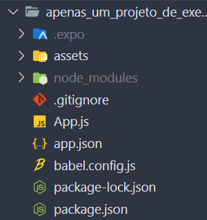

# Instalacao e utilizacao de React Native

ola, bem vindo a esse repositorio

este, tem como objetivo deixar claro o que eh o react native, como utilizar o facilitador dele chamado expo e como, enfim, utilizar uma ferramenta de desenvolvimento completo android <3

## Index

```txt
2. INSTALACAO EXPO
    2.1 O que eh o Expo e o React Native?
    2.2 Comandos do Expo
    2.3 Estrutura de Pastas
    2.4 Componentes
    2.5 Estilizacao
```

---

## 2. INSTALACAO EXPO

Antes mesmo de entendermos o que eh o expo e o react native iremos fazer a instalacao do mesmo em nossa maquina (no caso nao iremos instalar nada, pois ao crirar um projeto ele cria automaticamente para a gente)


---

1. abra o site do expo [link](https://expo.dev/)

> o ideial eh ja criar uma conta neste site, para fazer o *deploy* de projetos utiliza-se o site do mesmo. Entretanto nao mostrarei nesse repositorio, apenas dizendo que eh interessante.

tambem instale o aplicativo no seu celular com o nome de Expo, ele vai ser importante para o desnvolvimento pois ele que ira ser responsavel pelo trabalho de rodar o aplicativo que esta criando no seu celular. Confuso? Um pouco, mas o importante eh que funciona, e muito bem inclusive. Mais para frente isso sera explicado melhor, por enquanto, instale o aplicativo, e continue a leitura

---

2. abra a parte de utilizacao [link](https://docs.expo.dev/)

> aqui um quick start eh mostrado e um codigo mostrado


vamos incrementar um pouco esse script e explicar oq faz

em uma pasta de sua preferencia (documentos, por exemplo) escreva a seguinte linha de codigo:

```sh
npx create-expo-app -t # -t == --template oq isso faz? simplesmente cria uma CLI para podermos escolher o nome do nosso projeto, o template e tipo do projeto (caso queira usar typescript por exemplo, ou ja trazer um app com uma navegacao configurada, enfim)
```

ao rodar esse codigo no terminal do diretorio que decidiu criar um projeto:


escreva *y* e aperte enter algo sera baixado (similar ao donwload de um pacote no npm, pois eh exatamente isso, esta baixando o script de instalacao do expo em sua maquina, e rodando ele)

---

3. apos a instalacao que deve ser bem rapida, um template sera mostrado para sua escolha


com as setinhas do teclado pode selecionar dentre as opcoes, um projeto blank seria um projeto vazio, sem codigo adicoinal, o navigation ja viria com uma navegacao, e o blank (bare) traria a estrutura padrao do React Native, mais para frente ira entender...

apenas aperte enter e contine o processo de criacao

---

4. agora crie um nome para seu projeto


apos apertar enter, um diretorio sera criado com um bocado de pastas, se ele tiver deixado de criar alguma dessas nao se preocupe, pode variar de versao para versao



vamos ver oq ele criou

* `.expo/`
    * uma pasta que contem configuracoes para rodar o expo no celular
* `assets/`
    * algumas das imagens do programa estao aqui por padrao
* `node_modules/`
    * ja falamos dele em outro repositorio, caso ainda tenha duvida sugiro ver [esse repositorio](https://github.com/davieduardo001/como_usar_node_e_outros_insights)
* `App.js`
    * a primeira tela do nosso aplicativo
    * se voce ja viu HTML alguma vez na vida esta familiarizado com parte desse codigo, entretanto, parece ainda uma sopa de letrinhas
    * vamos mexer bastante com ele ainda, aguarde
* `app.json`
    * algumas das configuracoes para a aplicacao
    * como ele deve rodar em cada dispositivo, por exemplo
* `babel.config.js`
    * babel eh um transcompilador JS, ou seja, ele reescreve alguma coisa que nao eh JS em codigo JS
    * algo interessante de saber eh que o codigo que esta em `App.js` mesmo rodando como JS nao eh JS, eh JSX que eh essa sopa de letrinha, de parecer JS, com HTML, e la em baixo um pouco de CSS, basicamente o *babel* vai fazer a conversao para JS
    * depois o React Native vai converter para uma plataforma que escolhermos
    * e onde o expo entra nisso tudo? ele junta tudo, empacota em um monte de ferramentas e deixa mais facil o desenvolvimento, veremos mais para frente
* `package-lock.json` e `package.json`
    * ja passamos por ele dentro do [outro repositorio](https://github.com/davieduardo001/como_usar_node_e_outros_insights), caso ainda tenha duvida

---

*bem o projeto expo foi inicializado, agora eh fazer sua utilizacao, e entender um pouco como ele funciona, vamos ver adiante*

### 2.1 O que eh o Expo e o React Native?

vamos comecar, oq eh React? *mas pera, isso nao tava na pergunta...*

> imagina, css, html e js, juntos em um framework, que de forma unificada de codigo gerem uma pagina web completa? isso eh o react, um framework front-end para a criacao de aplicacoes web com foco em *componentizacao*. Em outras palavas, voce vai escrever um codigo JS (mais especificamente JSX) e gerar um site, com html, css e js, completa para uso.

onde o **react native** entra nisso tudo? A meta, e a comunidade, tratando de um projeto open-source pensou em criar, utilizando o react, um framework para a criacao de outros codigos finais, em vez de gerar codigos html, css e js, agora ele passaria a cirar codigo nativo andoid (convertendo o JSX para java) e para Ios (convertendo para Swift) deste modo, cria-se um codigo, para duas plataformas

e o *expo*?? como o proprio site fala: *"um conjunto de ferramentas para a criacao de aplicativos"* ou seja, ele empacotou, boa parte das funcionalidades do react native e facilitou para a gente, em vez de ter de baixas os compiladores do android (baixando o android studio, o java, junto com a jvm e todo o resto) o expo faz isso brilhantemente, deixando a compilacao por parte do proprio celular, com um aplicativo chamado Expo. Voce le o QR code com seu celular e BOOM tem um aplicativo rodando do jeito que quer... veremos como isso funciona na pratica

### 2.2 Comandos do Expo

para rodar a nossa aplicacao escreva na linha de comando da aplicacao:

```sh
npm start
```
ou
```sh
npx expo start
```

da no mesmo, lembra que npx executa um script? e o npm instala pacotes? entao, o comando npm start vai rodar uma serie de scripts presentes dentro do `package.json`, oq? pensou que fosse soh aquilo que ele fazia?

---

ao rodar esse codigo uma CLI aparecera mais ou menos assim:


---

pegue a camera do seu celular e leia o QR code, caso ja tenha instalado o Expo, ele vai abrir uma tela assim:


---

no CLI para dar reload no app aperte a tecla `r`, para para a execucao do programa aperte `Ctrl+D` e ele ira parar a execucao do programa para voce

### 2.3 Estrutura de Pastas

uma boa pratica dentro do React Native eh a criacao de uma pasta contendo os componentes, imagens, telas, o codigo, da aplicacao em si, chamada `src` todo outro arquivo que criarmos, em sua maioria vai nela

a pasta ficaria mais ou menos assim:


adicione uma pasta `src` e algumas dessas outras pastas dentro da mesma dentro do nosso projeto, apenas para exemplificacao

### 2.4 Componentes

ok, entendemos que a base do React sao os componentes, deste modo, para estarmos utilizando e entendermos eles vamos colar esse codigo dentro do `App.js` e trocaremos o nome desse aquivo para `App.jsx` apenas por convensao, nao seria necessario, o React ja sabe oq esta fazendo por de baixo dos panos

*./App.jsx*
```jsx
import { StyleSheet, Text, TouchableOpacity, View } from 'react-native';

export default function App() {
  return (
    <View style={styles.container}>
      <Text>Nosso primeiro appzinho :P</Text>

      <TouchableOpacity style={styles.buttonContainer}>
        <Text style={styles.txt}>
          Button
        </Text>
      </TouchableOpacity>
    </View>
  );
}

const styles = StyleSheet.create({
  container: {
    flex: 1,
    backgroundColor: '#fff',
    alignItems: 'center',
    justifyContent: 'center',
  },

  buttonContainer: {
    backgroundColor: `#BEFFF7`,
    padding: 16,
    borderRadius: 30,
    width: 200,
    alignItems: 'center'
  },
  
  txt: {
    fontSize: 24
  }
});

```

ao colar seu app ira atualizar automaticamente, isso eh bom, aaaa se isso eh bom...

---

1. criamos um componente? sim!! criamos um botao, estilizado do jeito que gostariamos, entretanto, nossa pagina inicial ainda esta muito poluida, nao acha? vamos componentizar esse app

crie um arquivo chamado `button.jsx` dentro da pasta `components/` da aplicacao

*./src/components/button.jsx*
```jsx
import {TouchableOpacity, Text, StyleSheet} from 'react-native';

export const Button = () => {
    return (
        <TouchableOpacity style={styles.buttonContainer}>
            <Text style={styles.txt}>
                Button
            </Text>
        </TouchableOpacity>
    )
}

const styles = StyleSheet.create({
    buttonContainer: {
        backgroundColor: `#BEFFF7`,
        padding: 16,
        borderRadius: 30,
        width: 200,
        alignItems: 'center'
      },
      
      txt: {
        fontSize: 24
      }
})
```

ok, agora com o componente criado vamos importar dentro do `App.jsx`, cole o seguinte codigo acima do linha `export default...`

```js
// ... resto do codigo para cima
import { Button } from './src/components/button';
// ... resto do codigo para baixo...
```

e no final o codigo do `App.jsx` ficaria mais ou menos assim, retirando os componentes e a estilizacao que utilizamos:

*./App.jsx*
```js
import { StyleSheet, Text, View } from 'react-native';

import { Button } from './src/components/button';

export default function App() {
  return (
    <View style={styles.container}>
      <Text>Nosso primeiro appzinho :P</Text>
      <Button></Button>
    </View>
  );
}

const styles = StyleSheet.create({
  container: {
    flex: 1,
    backgroundColor: '#fff',
    alignItems: 'center',
    justifyContent: 'center',
  },
});
```

---

2. vamos ver o poder dos componentes? altere o codigo do `button.jsx` para o seguinte:

*./src/componentes/button.js*
```js
import {TouchableOpacity, Text, StyleSheet} from 'react-native';

export const Button = ({text}) => {
    return (
        <TouchableOpacity style={styles.buttonContainer}>
            <Text style={styles.txt}>
                {text}
            </Text>
        </TouchableOpacity>
    )
}

const styles = StyleSheet.create({
    buttonContainer: {
        backgroundColor: `#BEFFF7`,
        padding: 16,
        borderRadius: 30,
        width: 200,
        alignItems: 'center'
      },
      
      txt: {
        fontSize: 24
      }
})
```

preste atencao na linha 3 e na linha 7, agora a linha 3 traz um parametro dentro da funcao chamada `({button})` oq isso faz? ele cria automaticamente um parametro chamado `props` do react native, ou seja, propriedades. Na linha 7 ele coloca entre chaves o nome da propriedade que criamos, ou seja, quando o `button` ser alterado, ele aterara aquele valor, dentro daquele componente `Text`...... vamos ver na pratica?

---

3. dentro do `App.jsx` cole esse codigo:

*./App.jsx*
```jsx
import { StyleSheet, Text, View } from 'react-native';

import { Button } from './src/components/button';

export default function App() {
  return (
    <View style={styles.container}>
      <Text>Nosso primeiro appzinho :P</Text>
      <Button text='button text'></Button>
    </View>
  );
}

const styles = StyleSheet.create({
  container: {
    flex: 1,
    backgroundColor: '#fff',
    alignItems: 'center',
    justifyContent: 'center',
  },
});
```

na linha 9 agora um parametro foi passado (lembrando baastante HTML nao eh mesmo??) pois eh, criamos um parametro que recebe um valor, atualize o valor, atualize o valor do parametro dentro do componente `button.jsx` pode se divertir um pouquinho ^^

---

basicamente a utilizacao de componentes se trata disso, poderiamos "quebrar" esse app em varias partezinhas que poderiamos compartilhar entre telas, poupando tempo e copia e cola, facilitando tambem o reaproveitamento de codigo para outros apps

### 2.5 Estilizacao

Ok, agora que entendemos componentes, precisamos entender a estilizacao, veja, que dentro de `App.jsx` na primeira linha um componente eh importado chamado `StyleSheet` da lib `react-native`, ele pega seu codigo JSX e faz parecer com CSS, facilitando tua vida um pouco, e fazendo a "magia" por baixos dos panos dessa estilizacao

---

por boas praticas, criamos uma pasta de `styles/` e um aquivo chamado `styles.jsx`, cole o seguinte codigo dentro dele:

*./src/styles/style.jsx*

```jsx
import { StyleSheet } from 'react-native';

export const styles = StyleSheet.create({
    container: {
        flex: 1,
        backgroundColor: '#fff',
        alignItems: 'center',
        justifyContent: 'center',
    },
})
```

e alteramos o `App.jsx`

./App.jsx

```jsx
import { Text, View } from 'react-native';

import { Button } from './src/components/button';
import {styles} from './src/styles/styles';

export default function App() {
  return (
    <View style={styles.container}>
      <Text>Nosso primeiro appzinho :P</Text>
      <Button text='button text'></Button>
    </View>
  );
}

```

bem mais limpo nao? pois, esse eh o poder do JS, dentro do `button.jsx` tambem vamos alterar uma coisinha

*./src/components/button.jsx*

```jsx
import {TouchableOpacity, Text} from 'react-native';
import { styles } from '../styles/styles';

export const Button = ({text}) => {
    return (
        <TouchableOpacity style={styles.buttonContainer}>
            <Text style={styles.txt}>
                {text}
            </Text>
        </TouchableOpacity>
    )
}
```

e o codigo final do `style.jsx` vai ficar assim:

*./src/styles/styles.jsx*

```jsx
import { StyleSheet } from 'react-native';

export const styles = StyleSheet.create({
    container: {
        flex: 1,
        backgroundColor: '#fff',
        alignItems: 'center',
        justifyContent: 'center',
    },

    buttonContainer: {
        backgroundColor: `#BEFFF7`,
        padding: 16,
        borderRadius: 30,
        width: 200,
        alignItems: 'center',
    },
      
    txt: {
        fontSize: 24,
    }
})
```

bem, a ideia eh essa, no video que segue de explicacao foram abordadas mais coisas, como useState, a execucao de codigo e logica dentro do codigo, e assim por diante, entao, por enquanto eh isso!!